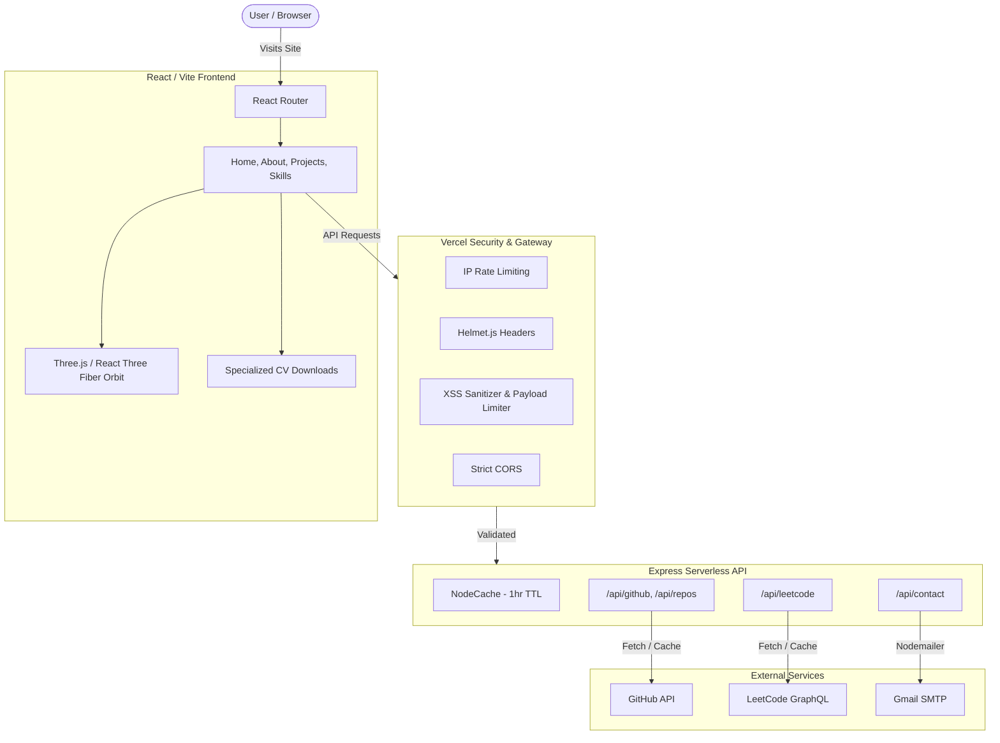

<div align="center">

#  SHLOK PATEL

### Interactive Digital System

[](https://react.dev)
[](https://threejs.org)
[](https://www.framer.com/motion/)
[](https://tailwindcss.com)
[](https://vite.dev)

*A high-performance portfolio engineered as a living digital system.*

---

</div>

##  What Makes This Different

This isn't a template. It's a **custom-built interactive system** where every animation has purpose and every pixel is intentional.

- **3D Technical Orbit** — Skills rendered as glass cubes orbiting in Three.js space. Click to filter projects.
- **Live Data Feeds** — GitHub repos and LeetCode stats pulled in real-time through a secure Express backend.
- **60fps Mobile** — Adaptive rendering automatically simplifies 3D on mobile devices.
- **Zero Interaction Overload** — Magnetic effects restricted to primary CTA only. Subtle > flashy.

---

## 🏛️ Architecture

```
src/
├── components/
│   ├── DigitalPulseLoader    # Boot sequence with orbital rings
│   ├── Dock                  # Floating nav bar (thumb-friendly)
│   ├── ErrorBoundary         # Graceful crash recovery
│   ├── HeroSystem            # R3F 3D hero scene
│   ├── LiveStats             # GitHub + LeetCode live feeds
│   ├── SkillsOrbit3D         # Interactive 3D skill showcase
│   ├── SkillCube             # Individual glass cube
│   └── TextReveal            # Per-character animation
├── pages/
│   ├── Home                  # Hero + stats
│   ├── Projects              # Filtered project grid
│   ├── Skills                # 3D orbit + repo filtering
│   ├── About                 # Bio + Specialized CVs
│   ├── Contact               # Email form
│   └── NotFound              # Custom 404
└── api/
    └── index.js              # Express (GitHub, LeetCode, Email)
```

### System Workflow


---

##  Setup

```bash
git clone https://github.com/LAN-SHLOK/portfolio.git
cd portfolio
npm install
npm run dev
```

#### Environment Variables

Create `.env` in root:

```env
EMAIL_USER=your-email@gmail.com
EMAIL_PASS=your-app-password
GITHUB_TOKEN=your-token          # optional, increases rate limit
```

---

##  Backend

| Feature | Implementation |
|---|---|
| Security | Helmet.js HTTP headers |
| Rate Limiting | 100 req/15min (general), 5/hr (contact) |
| Caching | NodeCache with 1hr TTL |
| Email | Nodemailer via Gmail |

---

##  Build

```bash
npm run build      # Production bundle
npm run preview    # Preview locally
```

**Chunk splitting** is configured — Three.js, Framer Motion, and React ship as separate cached bundles.

Deploys to **Vercel** with zero config. Serverless functions in `/api` auto-deploy.

---

##  Design Rules

| Rule | Detail |
|---|---|
| Primary Style | Glassmorphism |
| Palette | Monochrome + Cyan accent (`#06b6d4`) |
| Typography | Outfit (headings) + Inter (body) |
| Animations | CSS-first, JS only when 3D is required |
| Mobile | Auto-simplify 3D, disable magnetic effects |
| Performance | 60fps budget on mid-range devices |

---

<div align="center">

**Built by Shlok Patel** · IIT Madras · LJIET

[](https://github.com/LAN-SHLOK)

</div>
